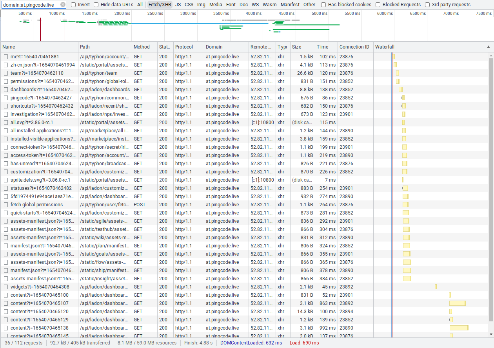
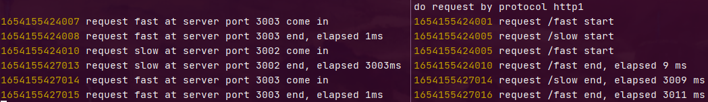
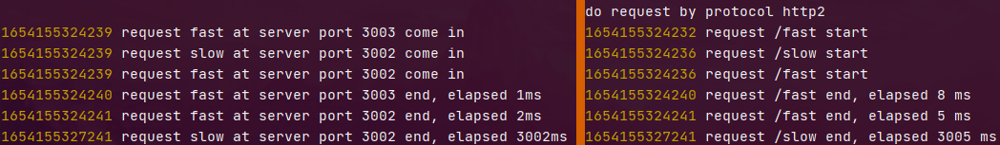
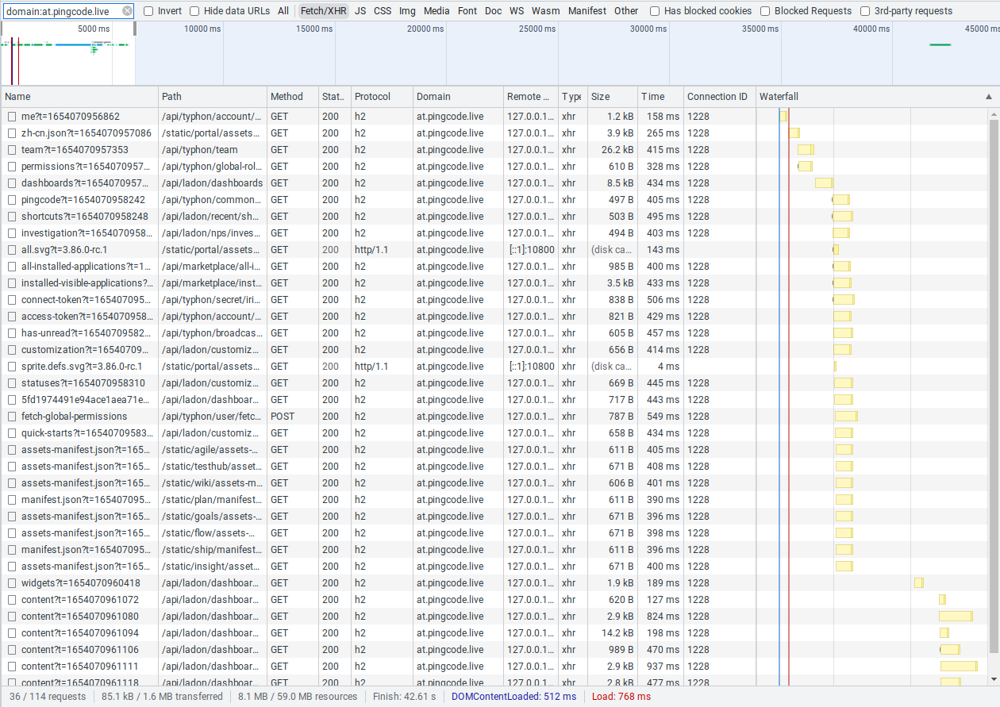
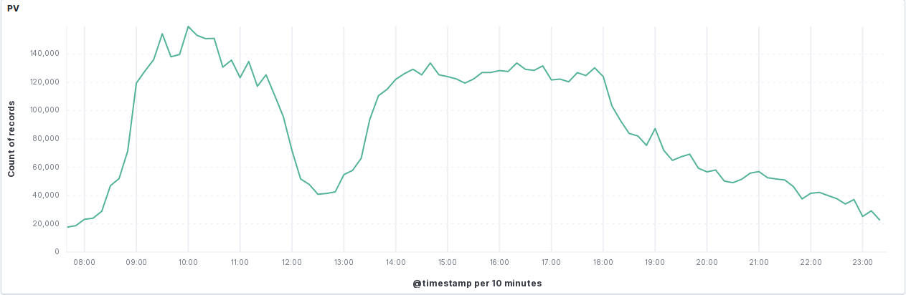

# 背景和目的
> 以下都是基于 PingCode 前后端 API 通信现状场景进行的分析。

目前前端请求 api 服务，依旧使用 http/1.1 协议。而目前主流 http 协议已经逐渐过渡到了 http/2，例如静态资源托管就使用 http/2 协议。因此有必要考虑将 API 服务也迁移到 http/2。不仅是要跟随技术潮流，也要有实打实的好处才值得。

众所周知，各浏览器对向同一域发起的 http 请求连接有并行连接数上的限制，再加上 http/1.1 每个连接只能同时处理一个请求，因此限制了 http 并行请求数。

>主流浏览器对 http/1.1 并行连接数的限制
Firefox 2:  2
Firefox 3+: 6
Opera 9.26: 4
Opera 12:   6
Safari 3:   4
Safari 5:   6
IE 7:       2
IE 8:       6
IE 10:      8
Edge:       6
Chrome:     6

页面加载时，并发请求几个十几个是常有的事，由于上述限制的存在，会导致页面响应延迟。并发请求也会导致同时建立多个连接。
>这是目前请求默认仪表盘发起的请求，Protocol 代表协议，Connection Id 代表连接。可以看到，目前使用多个连接发起请求。

http/2 具有的一项能力，就是支持请求多路复用，或者说请求并行——多个请求可以在一个连接上同时进行。
因此使用 http/2 代替 http/1.1，就可以解决上面的问题，让**页面响应速度更快**，带来更好的用户体验，同时还**减少了连接数**，减轻服务器压力。

# 技术验证
接下来，在考虑现有基础设施的基础上，我们进行一些技术验证，确认 http/2 确实能达到预期的效果。

## 可行性分析

目前 API 的请求涉及这些底层设施：
- 前端：作为 http 请求发起端
    - 包括主流浏览器的网页端、微信浏览器和小程序、Android 和 iOS App
- 网关：负责负载均衡和转发
    - 包括 AWS 4层（TCP）负载均衡和 Nginx 网关
- 后端服务
    - http 服务器由 chaos 使用 NodeJS http 模块提供
    - 服务是多实例的

逐个分析：
- 前端
    - 网页端：通过 JS XHR 发起 http 请求，目前主流浏览器均已支持 http/2
    - 微信浏览器 xweb 内核：官方说不支持
    - App：理论上支持
    - 尽管规范不要求，但浏览器实现要求 TLS 1.2 版本及以上的安全页面中才能使用 http/2
- 网关
    - AWS 负载均衡：工作在4层，不影响 http 这种应用层协议，无需考虑
    - Nginx 网关：目前已经有官方模块 [ngx_http_v2_module](http://nginx.org/en/docs/http/ngx_http_v2_module.html) 来支持 http/2 作为 http 服务入口，并转发到 http/1.1 服务器
        - `ngx_http_v2_module` 支持在开启 ssl 时在同一套接字同时接收 http/1.1 和 http/2 请求
        - 同时，Nginx 负责 SSL 终结，且使用 TLS 1.2
- 后端服务
    - Nginx 的支持，使得后端服务不需要做改动
    - 另外，由于后端服务是多实例的，前端发起的并行请求在 Nginx 到后端服务之间由多连接来承载
  
依据上面的分析，整体运行效果是这样的：
1. 前端发起 http 请求
    - 在协商环节，通过 SSL ALPN 技术，客户端知晓服务端支持 http/2 协议并决定发送 http/2 请求
    - 对于不支持 http/2 的客户端，支持使用 http/1.1 协议
2. 到 AWS 负载均衡作为 TCP 流量直接通过
3. 到 Nginx 网关进行 SSL 终结并由 http/2 模块接收请求
  - 同一个套接字同时支持 http/1.1 和 http/2
  - 在这里，由于面对的是 Nginx http/2 服务器，客户端请求可以并行
4. Nginx 上游有多个后端服务实例，每个请求通过 http/1.1 发到一个实例，实现请求并行处理
    - 虽然向后端服务发起的是 http/1.1，但是可以同时发起多个连接
    - 由于这里是内网，多个连接的开销并不大

经过这一番分析，理论上最初提出的目的是可实现的。接下来需要进行相应的技术验证。

## 技术原型验证
我使用 Node 写了一个简单的 http 服务器和客户端，配合 Nginx，来验证 http/1.1 和 http/2 在并发请求时的表现出来的不同效果，确认 http/2 的确能达到预期的效果——**让请求并行且响应更快**。

> 项目位于 https://github.com/zyf0330/test-http2-parallel-request

使用这个项目可以看到以下效果：
> 这里前端访问的是 Nginx 网关，上游有两个服务实例3002和3003
1. 对于同一连接上并发的 http/1.1 请求，服务器是顺序处理的。下图可以看出，并发的第三个快请求被第二个慢请求拖慢了。

2. 对于 http/2，三个请求完全是并行的。

## 实际环境验证
1. 使用自签名证书+Nginx代理 API 服务，并在浏览器中选择绕过不安全证书，证实浏览器无需改动即可支持。

2. live 环境在 https://http2.pingcode.live 域名开启 http2 进行测试
[x] 主流浏览器 h2
[x] App Android 和 iOS 均使用 h2
[x] 微信浏览器 h2
[x] 微信小程序 h1.1（官方不支持）

# 方案
经过上面的技术验证，能看出升级 http/2 是能达到预期目的的，并且对现有环境的改动也很小。不过除了支持 http/2，我们也要同时支持 http/1.1 来兼容微信小程序。

因此最好的方案是——在 Nginx 网关层做改动，为 Nginx 安装 http/2 模块，并追加开启 `http2` 配置。
这个方案，不仅能支持 http/2，同时保留了 http/1.1 的兼容，成本也极小。应该是最好的方案。

> **注意：nginx 在 `server` 上开启 `http2` 时不支持 SNI**

> 还记得吗，由于 Nginx 同时负责 SSL 终结，所以这里可以同时支持 http/1.1 和 http/2，为不支持 http/2 的微信小程序端提供兼容。

# 可能带来的问题
使用 http/2 会带来好处，但也可能带来问题，这些问题可能是迁移带来的，也可能是 http/2 自身技术带来的。下面讨论一个可能出现的问题。

## 瞬时请求量提升提升瞬时压力
对于单个页面来说，并行请求数上限增加，会提高瞬时请求量，从而提高后端服务瞬时压力。
我们来论述一下，这会不会造成实际问题。

先考虑一个最简单的模型，每秒有*x*个用户，每个用户请求*n*次：
在 http/1.1 下，由于并行请求限制，假设这*n*次请求被延迟在3秒内处理完，那么在第1秒会有*n\*x/3*个请求，第2秒会有*n\*x/3\*2*个请求，第3秒及以后的每一秒都会有*n\*x/3\*3*即*n\*x*个请求。而在 http/2 下，由于不存在并行请求限制，在第1秒及以后的每一秒，请求数都是*n\*x*。
在这个均匀请求频率模型中，http/1.1 和 http/2 的 QPS 差别只在开头几个单位时间存在，我们暂时叫它**过渡阶段**。这个阶段的时间长度取决于并行请求量限制和请求处理时间。在度过这个阶段后，两种协议下 QPS 会相同。当用户请求停止时，http/1.1 协议上的请求会反向递减，这也是过渡阶段。
假设用户请求不是均匀的，而是每3秒一波呢？对于 http/1.1 来说，它的峰值 QPS 就变成了*n\*x/3*，但对于 http/2 则依旧是 *n\*x*。

因此在用户请求量突增这样的极限情况下，http/2 协议的系统峰值压力会更大。

不过考虑系统的实际情况：
首先是请求平均处理耗时在十毫秒到百毫秒级别。这里百毫秒就是上述模型中的**过渡阶段**，换句话说，就是在大于百毫秒的时间尺度上，由于两种协议的不同带来的瞬时请求量差异就无法被观测到了。
其次通过 kibana 的 api PV 图能看到，总瞬时请求量在上午是逐渐上升的，大致取一些时间点，能看出这个上升幅度是在分钟级别的时间尺度上。那么就不应当是由于协议不同带来的，可以认为这是活跃用户量上升带来的。
再看下午14点-18点，这个阶段瞬时请求量基本保持不变。从业务层面考虑，实际的用户请求时机不应当是在时间轴上规律的，那么根据上述模型，这个瞬时请求量就是峰值瞬时请求量。

通过上面的论述，应当能得出结论，使用 http/2 协议不会提高现有系统的峰值压力。

那么并行请求量限制的提升，会直接导致用户请求频率提升吗？是不会的。这么考虑，用户是基于主业工作来使用我们的产品，在这里我们的产品起到的是一个辅助作用。也就是说，用户对我们产品的使用频率，总体上来说是被动的、非正反馈的。那么，系统反应变快，不会使得用户提高输入频率。
> 举个不同的例子，玩某些游戏比如打地鼠，游戏元素和画面反应越快我们和游戏的交互也会越快。这是用户输入根据系统反应正反馈的例子。

但是，系统反应变快却可能会间接导致用户请求概率提升。比如，在满足用户基本需要的基础上，反应更快的系统会减少用户等待的焦虑，可以作为加分项吸引更多用户使用。但这点不会增加单个用户的请求概率，而是扩大了用户规模。

# 总结
上述技术验证和相关论证，都是**理论上**的，而理论是需要经过实际验证的。
为了系统的稳定，像更换底层协议这种影响范围广大的动作，必须经过测试才能应用，例如压力测试、稳定性测试等。测试通过后，还会在各级线上环境逐级应用，来进行测试。这部分本文就不涉及了。

